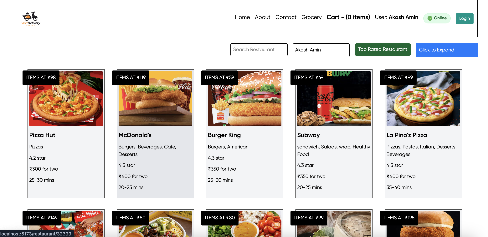
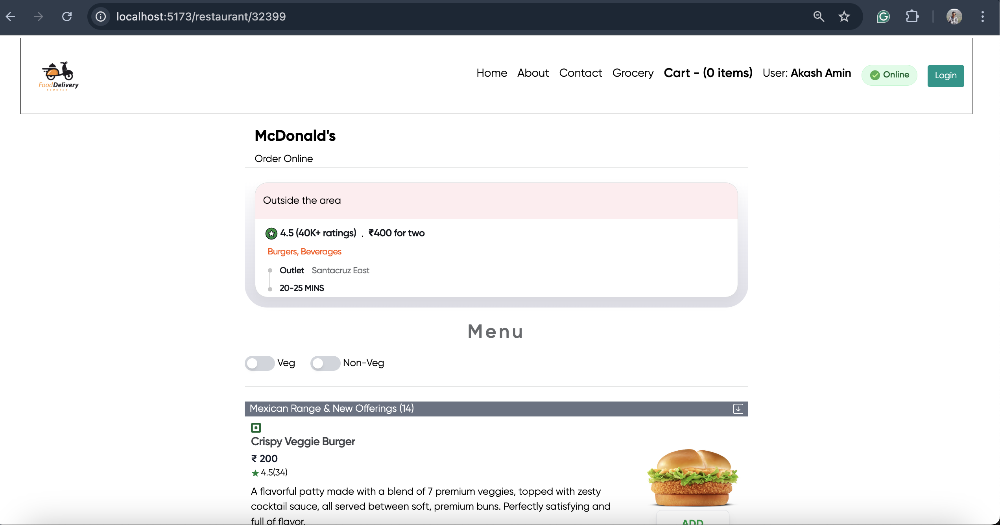
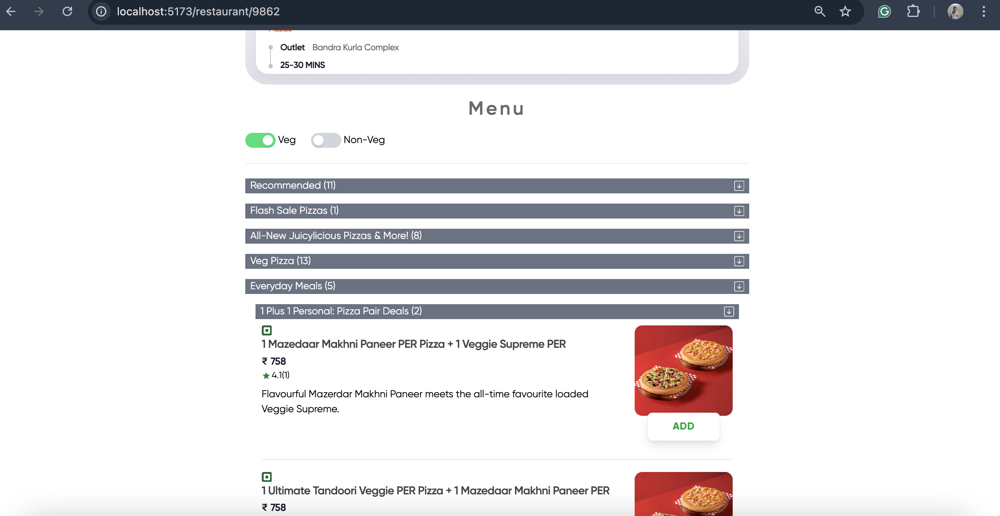
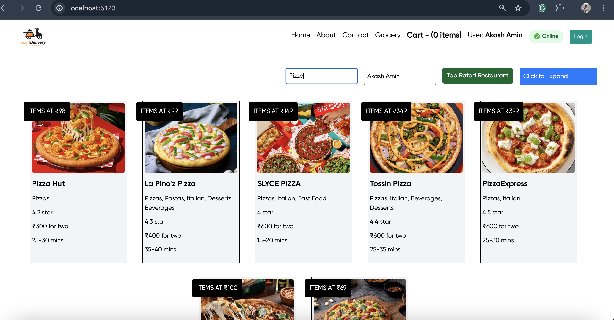
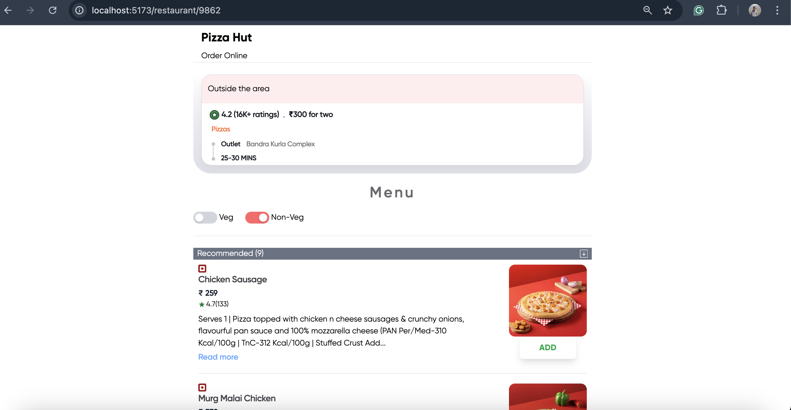
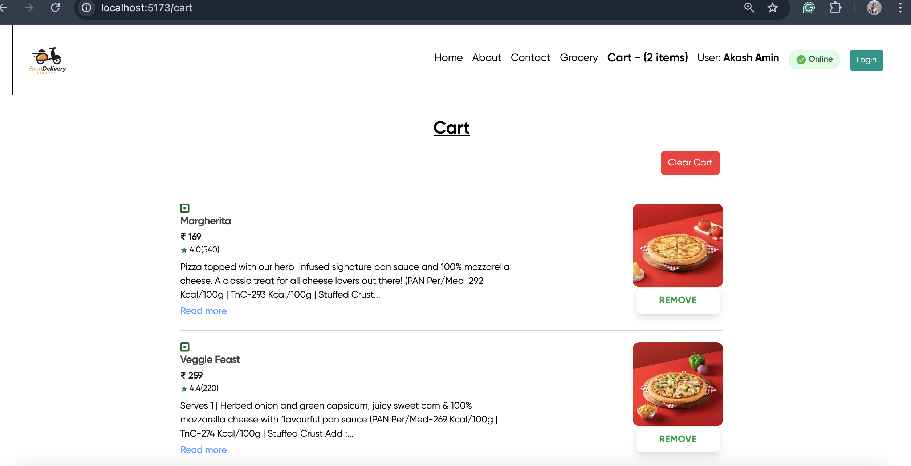

# 🍕 FoodDeliver App - React

A modern, responsive food delivery application built with React, featuring real-time restaurant data, advanced filtering, cart management, and comprehensive testing suite.

## 🚀 Live Demo
**[View Live App](https://food-deliver-app-react.vercel.app/)**


## 📱 Screenshots

### Home Page - Restaurant Listings


_Browse through various restaurants with search and filter functionality_

### Restaurant Menu - McDonald's


_Detailed restaurant menu with veg/non-veg filters and item descriptions_

### Accordion Component - Menu Categories


_Collapsible accordion component showing menu categories with expand/collapse functionality_

### Search Functionality - Pizza Results


_Real-time search showing filtered results for "Pizza" - displays 4 matching restaurants instantly_

### NonVeg Filter Active


_Smart filtering system to show only non-vegetarian options_

### Shopping Cart


_Clean cart interface with item management and total calculation_

## ✨ Features

### 🏠 Core Functionality

- **Real-time Restaurant Data**: Integration with live Swiggy API
- **Advanced Search**: Search restaurants by name and cuisine
- **Smart Filtering**: Top-rated restaurants filter (rating > 4.5)
- **Responsive Design**: Mobile-first approach with TailwindCSS
- **Online/Offline Status**: Real-time connectivity indicator

### 🍽️ Restaurant & Menu

- **Restaurant Cards**: Display with ratings, cuisine, delivery time, and cost
- **Detailed Menu**: Categorized menu items with descriptions
- **Veg/Non-Veg Toggle**: Filter menu items by dietary preferences
- **Promotional Labels**: HOC-based promoted restaurant cards
- **Dynamic Routing**: Individual restaurant pages with menu

### 🛒 Shopping Experience

- **Redux Cart Management**: Add/remove items with state persistence
- **Cart Counter**: Real-time item count in header
- **Item Management**: Quantity controls and item removal
- **Total Calculation**: Dynamic price calculation

### 🎨 UI/UX Features

- **Shimmer Loading**: Elegant loading states for better UX
- **Lazy Loading**: Code splitting for optimal performance
- **Accordion Components**: Collapsible content sections
- **Context API**: User authentication and theme management
- **Error Boundaries**: Graceful error handling

### 🧪 Testing & Quality

- **Comprehensive Test Suite**: 95%+ test coverage
- **Component Testing**: Individual component unit tests
- **Integration Testing**: User flow and interaction tests
- **Mock Data**: Realistic test data for consistent testing
- **Vitest + React Testing Library**: Modern testing stack

## 🛠️ Tech Stack

### Frontend

- **React 19.1.0** - Latest React with concurrent features
- **Redux Toolkit** - State management with RTK
- **React Router DOM** - Client-side routing
- **TailwindCSS** - Utility-first CSS framework
- **React Icons** - Comprehensive icon library

### Development & Testing

- **Vite** - Fast build tool and dev server
- **Vitest** - Lightning fast unit testing
- **React Testing Library** - Component testing utilities
- **ESLint** - Code linting and formatting
- **jsdom** - DOM testing environment

### Build & Deployment

- **Vite Build** - Optimized production builds
- **Code Splitting** - Lazy loading for performance
- **Hot Module Replacement** - Fast development experience

## 🚀 Getting Started

### Prerequisites

- Node.js (v16 or higher)
- npm or yarn package manager

### Installation

1. **Clone the repository**

   ```bash
   git clone https://github.com/yourusername/FoodDeliver-App-React.git
   cd FoodDeliver-App-React
   ```

2. **Install dependencies**

   ```bash
   npm install
   ```

3. **Start development server**

   ```bash
   npm run dev
   ```

4. **Open your browser**
   ```
   http://localhost:5173
   ```

### Available Scripts

```bash
# Development
npm run dev          # Start development server
npm run preview      # Preview production build

# Building
npm run build        # Create production build
npm run lint         # Run ESLint

# Testing
npm run test         # Run test suite
npm run test:ui      # Run tests with UI interface
```

## 📁 Project Structure

```
src/
├── components/          # Reusable UI components
│   ├── Header.jsx      # Navigation header with cart
│   ├── RestaurantCard.jsx  # Restaurant display card
│   ├── CartItems.jsx   # Cart item management
│   ├── MenuItem.jsx    # Menu item component
│   ├── Shimmer.jsx     # Loading skeleton
│   └── ...
├── pages/              # Route-based page components
│   ├── Body.jsx        # Home page with restaurants
│   ├── RestMenu.jsx    # Restaurant menu page
│   ├── Cart.jsx        # Shopping cart page
│   └── ...
├── utils/              # Utility functions and hooks
│   ├── useOnlineStatus.js  # Online status hook
│   ├── appStore.js     # Redux store configuration
│   ├── cartSlice.js    # Cart state management
│   └── ...
├── tests/              # Test files
│   ├── components/     # Component tests
│   └── __mocks__/      # Mock data and functions
├── mocks/              # Static mock data
└── layouts/            # Layout components
├── App.jsx                 # Main application component with routing
├── index.css               # Global styles and shimmer animations
└── main.jsx               # Application entry point
```

## 🚀 Getting Started

### Prerequisites

- Node.js (version 16 or higher)
- npm or yarn package manager

### Installation

1. Clone the repository:

```bash
git clone <repository-url>
cd FoodDeliver-App-React
```

2. Install dependencies:

```bash
npm install
```

3. Start the development server:

```bash
npm run dev
```

4. Open your browser and navigate to `http://localhost:5173`

## 📜 Available Scripts

- `npm run dev` - Start development server
- `npm run build` - Build for production
- `npm run preview` - Preview production build
- `npm run lint` - Run ESLint for code quality checks

## 🎨 Components Overview

### Header Component

- Displays the FoodDeliver logo
- Navigation menu with Home, About, Contact, and Cart links
- Responsive design with proper spacing
- Integrated with React Router for navigation

### Body Component

- **Enhanced Search Bar**: Real-time restaurant filtering with instant results
- **Top Rated Restaurant Filter**: Button to filter restaurants with 4.5+ star ratings
- **Advanced State Management**:
  - Loading states with shimmer UI
  - Separate filtered and main restaurant lists
  - Search text state management
- **Error Handling**: Graceful handling of API failures
- **Empty State**: "No restaurants found" message with helpful text
- Restaurant container displaying filtered restaurants
- Maps through restaurant data to render individual cards
- Responsive layout with search and filter controls

### RestaurantCard Component

- Displays restaurant image from Swiggy CDN
- Shows restaurant name, cuisine types, ratings, cost, and delivery time
- Hover effects for better user interaction
- Consistent styling with proper spacing

### Shimmer Components

- **Shimmer.jsx**: Individual loading skeleton matching RestaurantCard structure
- **ShimmerContainer.jsx**: Container displaying 12 shimmer cards
- **Custom CSS Animation**: Smooth shimmer effect with gradient animation
- **Responsive Design**: Matches actual card dimensions and layout

### Footer Component

- **Sticky Footer**: Always stays at bottom of page
- Dynamic copyright year
- Consistent styling with site theme
- Responsive layout for mobile and desktop

### Layout System

- **MainLayout.jsx**: Flexbox-based layout ensuring footer stays at bottom
- **Routing Integration**: Wraps all pages with consistent header/footer
- **Responsive Container**: Proper spacing and mobile optimization

## 🚀 Key Features Explained

### Shimmer Loading UI

- **Purpose**: Provides visual feedback while restaurant data loads
- **Implementation**: CSS animations with gradient effects
- **User Experience**: Reduces perceived loading time
- **Responsive**: Adapts to different screen sizes

### Enhanced Search Functionality

- **Real-time Filtering**: Results update as you type
- **Case Insensitive**: Search works regardless of letter case
- **State Management**: Maintains original data for filtering
- **Empty State Handling**: Shows helpful message when no results found
- **Clear Functionality**: Empty search restores full restaurant list

### API Integration

- **Live Data**: Fetches real restaurant data from Swiggy API
- **Error Handling**: Graceful fallback when API fails
- **Loading States**: Proper loading indicators during data fetch
- **Optional Chaining**: Safe data access preventing crashes

### Routing System

- **React Router**: Multi-page navigation
- **Layout Wrapper**: Consistent header/footer across pages
- **404 Handling**: Proper error page for invalid routes

## 🔧 Customization

### Adding New Pages

1. Create new component in `src/pages/`
2. Add route in `App.jsx`
3. Update navigation in `Header.jsx`

### Modifying Shimmer Animation

Update the CSS in `src/index.css` to customize the shimmer effect:

```css
.shimmer {
  background: linear-gradient(90deg, #f0f0f0 25%, #e0e0e0 50%, #f0f0f0 75%);
  background-size: 200% 100%;
  animation: shimmer 1.5s infinite;
}
```

### Styling

The app uses Tailwind CSS. Modify classes in components or extend the Tailwind configuration for custom styling.

### Constants

Update `src/utils/comman.js` to modify image URLs or other constants.

## 🤝 Contributing

1. Fork the repository
2. Create a feature branch (`git checkout -b feature/amazing-feature`)
3. Commit your changes (`git commit -m 'Add some amazing feature'`)
4. Push to the branch (`git push origin feature/amazing-feature`)
5. Open a Pull Request

## 📝 License

This project is open source and available under the [MIT License](LICENSE).

## 🙏 Acknowledgments

- Restaurant data and images sourced from Swiggy API
- Built with modern React practices and hooks
- Styled with Tailwind CSS for rapid development
