# 🥬🍖 Veg/Non-Veg Filter Implementation Guide

## 📋 Overview

This document explains the complete implementation of veg/non-veg filtering functionality in the FoodDeliver React app. The filtering works across both regular menu items and nested menu categories using the Swiggy API structure.

## 🏗️ Architecture Flow

```mermaid
graph TD
    A[RestMenu Component] --> B[ToggleBtn Component]
    A --> C[Regular Menu Items]
    A --> D[Nested Menu Categories]

    B --> E[handleVegToggle]
    B --> F[handleNonVegToggle]

    E --> G[selected = 'VEG']
    F --> H[selected = 'NONVEG']

    G --> I[Filter Regular Items]
    H --> I
    G --> J[Filter Nested Items]
    H --> J

    I --> K[MenuItem Component]
    J --> L[NestedMenu Component]

    L --> M[Filter Each Category]
    M --> N[MenuItem Component]
```



## 🔧 Component Structure

### 1. **RestMenu.jsx** (Main Container)

- Manages filter state (`selected`)
- Handles both regular and nested menu filtering
- Calculates item counts for menu titles

### 2. **NestedMenu.jsx** (Nested Categories)

- Receives filtered categories
- Applies filtering to each category's items
- Hides empty categories after filtering

### 3. **ToggleBtn.jsx** (Filter Controls)

- Provides VEG/NON-VEG toggle buttons
- Updates the `selected` state

## 📊 Data Flow Diagram

```
┌─────────────────┐    ┌──────────────────┐    ┌─────────────────┐
│   ToggleBtn     │───▶│   RestMenu       │───▶│   NestedMenu    │
│                 │    │                  │    │                 │
│ - VEG Button    │    │ - selected state │    │ - Filter items  │
│ - NON-VEG Button│    │ - Filter logic   │    │ - Hide empty    │
│                 │    │ - Count items    │    │   categories    │
└─────────────────┘    └──────────────────┘    └─────────────────┘
         │                        │                        │
         ▼                        ▼                        ▼
┌─────────────────┐    ┌──────────────────┐    ┌─────────────────┐
│ Filter State    │    │ Filtered Data    │    │ Rendered Items  │
│                 │    │                  │    │                 │
│ - null (all)    │    │ - Regular items  │    │ - Only matching │
│ - "VEG"         │    │ - Nested items   │    │   items shown   │
│ - "NONVEG"      │    │ - Item counts    │    │                 │
└─────────────────┘    └──────────────────┘    └─────────────────┘
```

## 🔍 API Data Structure

### Swiggy API Response Structure:

```javascript
{
  card: {
    info: {
      name: "Chicken Biryani",
      price: 25000,
      itemAttribute: {
        vegClassifier: "NONVEG"  // ✅ This is what we use
      },
      // isVeg: 0  // ❌ Not reliable across all APIs
    }
  }
}
```

### Filter Property Path:

```javascript
item?.card?.info?.itemAttribute?.vegClassifier;
// Values: "VEG" | "NONVEG" | undefined
```

## 💻 Implementation Details

### 1. State Management (RestMenu.jsx)

```javascript
const [selected, setSelected] = useState(null);

const handleVegToggle = () => {
  setSelected((prev) => (prev === "VEG" ? null : "VEG"));
};

const handleNonVegToggle = () => {
  setSelected((prev) => (prev === "NONVEG" ? null : "NONVEG"));
};
```

### 2. Regular Menu Filtering (RestMenu.jsx)

```javascript
const itemCards = menu?.card?.card?.itemCards || [];
const filterData =
  selected === null
    ? itemCards
    : itemCards.filter(
        (item) => item?.card?.info?.itemAttribute?.vegClassifier === selected
      );
```

### 3. Nested Menu Filtering (RestMenu.jsx)

```javascript
const getTotalItemsInCategories = () => {
  if (categories.length === 0) return 0;

  return categories.reduce((total, category) => {
    const categoryItems = category?.itemCards || [];
    const filteredCategoryItems =
      selected === null
        ? categoryItems
        : categoryItems.filter(
            (item) =>
              item?.card?.info?.itemAttribute?.vegClassifier === selected
          );
    return total + filteredCategoryItems.length;
  }, 0);
};
```

### 4. Category-Level Filtering (NestedMenu.jsx)

```javascript
const filteredItems =
  selected === null
    ? itemCards
    : itemCards.filter(
        (item) => item?.card?.info?.itemAttribute?.vegClassifier === selected
      );

// Hide empty categories
if (filteredItems.length === 0) {
  return null;
}
```

## 🎯 Filter Logic Examples

### Example 1: VEG Filter Active

```javascript
// Input: selected = "VEG"
const items = [
  { card: { info: { itemAttribute: { vegClassifier: "VEG" } } } }, // ✅ Shown
  { card: { info: { itemAttribute: { vegClassifier: "NONVEG" } } } }, // ❌ Hidden
  { card: { info: { itemAttribute: { vegClassifier: "VEG" } } } }, // ✅ Shown
];

// Output: 2 items shown, 1 hidden
```

### Example 2: NONVEG Filter Active

```javascript
// Input: selected = "NONVEG"
const items = [
  { card: { info: { itemAttribute: { vegClassifier: "VEG" } } } }, // ❌ Hidden
  { card: { info: { itemAttribute: { vegClassifier: "NONVEG" } } } }, // ✅ Shown
  { card: { info: { itemAttribute: { vegClassifier: "NONVEG" } } } }, // ✅ Shown
];

// Output: 2 items shown, 1 hidden
```

### Example 3: No Filter (Show All)

```javascript
// Input: selected = null
const items = [
  { card: { info: { itemAttribute: { vegClassifier: "VEG" } } } }, // ✅ Shown
  { card: { info: { itemAttribute: { vegClassifier: "NONVEG" } } } }, // ✅ Shown
  { card: { info: { itemAttribute: { vegClassifier: "VEG" } } } }, // ✅ Shown
];

// Output: All 3 items shown
```

## 🔄 Component Interaction Flow

```
1. User clicks VEG/NON-VEG button in ToggleBtn
   ↓
2. ToggleBtn calls handleVegToggle/handleNonVegToggle
   ↓
3. RestMenu updates 'selected' state
   ↓
4. RestMenu re-renders with new filter
   ↓
5. Regular items get filtered in RestMenu
   ↓
6. Nested categories get filtered in NestedMenu
   ↓
7. Empty categories/sections are hidden
   ↓
8. UI updates to show only matching items
```

## 🎨 UI Behavior

### Filter States:

- **🟢 VEG Active**: Only vegetarian items visible
- **🔴 NON-VEG Active**: Only non-vegetarian items visible
- **⚪ No Filter**: All items visible

### Visual Indicators:

- Menu titles show correct item counts after filtering
- Empty categories completely disappear
- Toggle buttons highlight active filter state

## 🚀 Key Features

### ✅ What Works:

- **Dual Menu Support**: Works with both regular and nested menu structures
- **Dynamic Counting**: Menu titles show accurate filtered item counts
- **Smart Hiding**: Empty categories disappear when no items match filter
- **State Persistence**: Filter state maintained across menu interactions
- **API Compatibility**: Uses reliable `vegClassifier` property from Swiggy API

### 🔧 Technical Benefits:

- **Performance**: Efficient filtering with minimal re-renders
- **Maintainability**: Clean separation of concerns across components
- **Scalability**: Easy to extend for additional filter types
- **Error Handling**: Safe property access with optional chaining

## 🐛 Troubleshooting

### Common Issues:

1. **Filter not working**: Check if API returns `itemAttribute.vegClassifier`
2. **Wrong counts**: Verify filtering logic in both RestMenu and NestedMenu
3. **Categories not hiding**: Ensure `return null` logic is implemented
4. **State not updating**: Check if toggle functions are properly connected

### Debug Tips:

```javascript
// Add these console logs for debugging:
console.log("Selected filter:", selected);
console.log(
  "Item vegClassifier:",
  item?.card?.info?.itemAttribute?.vegClassifier
);
console.log("Filtered items count:", filteredItems.length);
```

## 📝 Code Files Modified

1. **`/src/pages/RestMenu.jsx`** - Main filtering logic and state management
2. **`/src/components/NestedMenu.jsx`** - Nested category filtering
3. **`/src/components/ToggleBtn.jsx`** - Filter controls (if exists)

## 🎯 Summary

This implementation provides a robust, scalable veg/non-veg filtering system that:

- Works seamlessly with Swiggy's API structure
- Handles both simple and complex menu hierarchies
- Provides excellent user experience with smart hiding of empty sections
- Maintains clean, maintainable code architecture

The filtering is now fully functional across all menu types! 🚀
